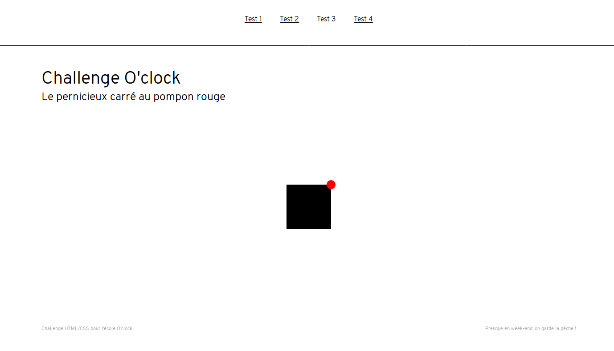

# Challenge n°9
Intitulé : **Parcours du combattant s01**  
https://github.com/O-clock-Explorer/parcours-du-combattant-s01-GuillaumeD84

Guillaume DURAND  
Promo : Explorer  
S2-J4 | 12/10/2017

Type : HTML | CSS | GitHub

## Objectif
Challenge “repère” divisé en 4 étapes pour se faire une idée de sa progression depuis le début de la formation.

### Test 1

### Test 2

Modifier le code CSS pour obtenir les effets suivant :

### Test 3

### Test 4

